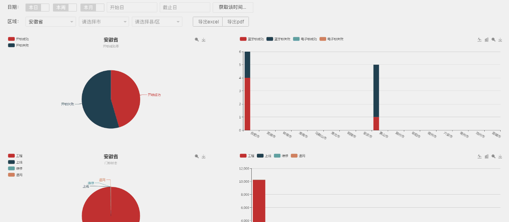

# statement-table
一个基于vue的含检索排序分页的表格[table](#table)和可以按条件过滤数据自动更新视图的图表[statement](#statement)。
## statement
#### 原料: `jquery.js` `Echart.js` `layui.js.` 
#### 快速上手(本例jsp)
* 1.)给省市区设置参数,本例是jsp :c foreach，下级js根据选择区域的code更新，方法不限。
```html
        <div class="layui-form-item">
        <label class="layui-form-label">区域：</label>
        <div class="layui-input-inline">
            <select name="province" lay-filter="province" id="province">
                <option value="">请选择省</option>
                <c:forEach var="pro" items="${areaList}" >
                    <option  value="${pro.code }" selected="">${pro.name}</option>
                </c:forEach>                
            </select>
        </div>
```
* 2.) 在`form.on`两个监听中写好省->市,市->区的ajax。
```js
        form.on('select(province)', function(data){
        $("#city").html("<option value=''>请选择市</option>");
        $("#area").html("<option value=''>请选择县/区</option>");
        $.ajax({
         type:"post",
          url:"<%=basePath%>statement/threelev.do",
          data:{"pro_id":data.value},
         success:function(data){
            //添加城市数据
            var html="<option value=''>请选择市</option>";
            for(var i=0;i<data.length;i++){
              html+="<option value='"+data[i].code+"'>"+data[i].name+"</option>";
            }
            $("#city").html(html);
            //重新渲染select
            form.render('select');
          },
          error: function(XMLHttpRequest, textStatus, errorThrown) {
               alert('意外错误')
          },
        }); 
        changeview();         
        });  
```
* 3.)`items_b1` `items_b2` `items_z1` `items_z2`是本例中的两个饼图和柱图的数据，通过工厂函数按需改成自己要的数据（如果修改记得在图表生成配置中也要同步修改）
* 4.)changeview()里获取新数据的ajax方法，本例提交后台4个参数`time` `starttime` `endtime` `areaCode`返回的数据按需修改，同理在`setoption`里按自己的数据需求修改。
* 5.)上传前我已在本例设好默认参数,可下在本地直接运行,详细的我在demo里都写好注释了，赶紧试试吧

#### tips:
* 导出excel和pdf是后台代码，可自行添加。canvas中点击弹出的列表按钮通过echarts里的toolbox自定义，layer.open同过弹窗查看表格数据。

#### 效果预览:

###### 思路简析:
* 1.)确定样式，设置动态参数项，本例为时间和区域，样式用layui为参考.
* 2.) 按需设置放置图标的视图区，本例共4个图表。
* 3.) 对内容进行布局（css）
* 4.) 通过echarts设置默认数据，在项目中首次加载将默认数据转化成json，按照不同图表需求转化成不同的数据格式。本例4条数据，写好数据转化函数（工厂模式）生成自己要的数据，配置到4个图表中，全部`setOption（option）`一下，生成图表。
* 5.) 设置图表加载特效和结束加载特效。
* 6.) 注册`layui`组件，写入日期和区域的监听事件（样式控制不多说）。日期可选日周月或时间区间，区域多级联动。
* 7.) 每次筛选条件发生改变执行`gettime()`和`getarea()`获取最新条件，然后执行视图驱动`changeview()`和图标加载特效`ALLchartload()`，ajax获取最新数据，丢到工厂函数里跑跑再异步更新到视图，更新完毕执行`ALLchartshow()`结束加载特效。
* 8.) 设置图表自适应屏幕大小.
```js
window.addEventListener("resize", function () {statement.resize();}
```
###### Tips：  
* 参数可以按需自行添加或者修改，只要在changeview里加入新的参数返回后台即可，适合各种场景下的数据过滤视图化功能。
## table
###### 本篇需要一定vue基础，新手可以结合vue的文档查看。
#### 原料:`Jquery.js` `bootstrap.js` `vue.js(1.x)`
#### 快速上手:
* 1.)获取数据，转换成json格式，放入data的items中，然后设置各种静态参数,demo里都是默认参数,按需自己修改,order是升序降序,mytrim设置检索对象的键名.
```js
    var itemsa=JSON.parse('${stationList}');//你的数据
    var example1 = new Vue({
        el: '#mybb',
        data: {
            order:-1,
            select:'',
            items: itemsa,
            size:8,
            page:1,
            searchcache:'',
            searchs:'',
            add:'1',
            cha:'1',
            edi:'1',
            del:'1',
            mytrim:['Name']
        },
    ...)}
```
* 2.)表头Th里需要排序的内容,@click="change1('Name')"里name为对应值对键名.
```html
<th class="center pointer" @click="change1('Name')"> <div class="init myb1" id="Name"><div></div><div></div></div>站点名称</th>
```
* 3.)同理循环渲染td里{{item.name}}设置好对应数据.
```html
            <td class="center" >{{ item.Name }}</td>
            <td class="center" >{{ item.pointX }}</td>            
            <td class="center" >{{ item.pointY}}</td> 
            ...
```
* 4.)赶紧去试试吧~

#### tips:
* method里的事件按需增删,demo里的例子仅供参考,该例适合各类表格数据展现和操作.

###### 思路简析:
* 1.) 架好页面，检索头，表格，分页。
* 2.) 获取数据，转化成json。
* 3.) 创建vue实例，分配`data`(静态参数),`computed`(动态参数),`methods`(逻辑事件)
* 4.) 渲染列表在循环渲染的过程中介入`fliterBy`用于检索,`orderby`排序,`limitBy`分页.  

```html
<tr v-for="item in items | filterBy searchs in mytrim | orderBy select order | limitBy size size*(page-1)" v-if="show">...</tr>
```

* 5.) 启用分页，在分页中写入跳页和每页显示条数事件。
* 6.) 所有操作都是操作vue里的参数，自动更新dom。

## About 关于咖喱
* [Github-Me](https://github.com/zogeli100)
* [QQ 418340696](https://zogeli100.github.io)

#### **转载请注明出处**
[https://github.com/zogeli100/statement-table](https://github.com/zogeli100/statement-table)
